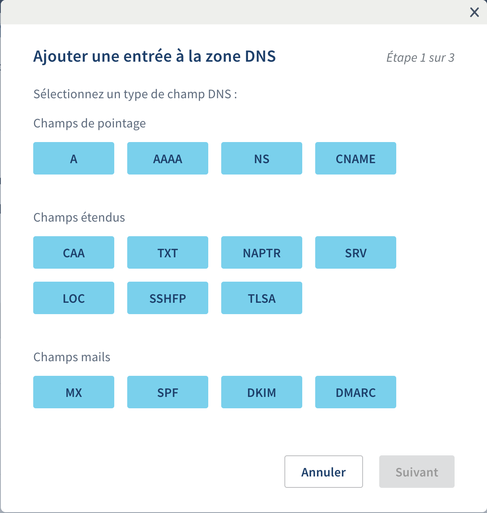
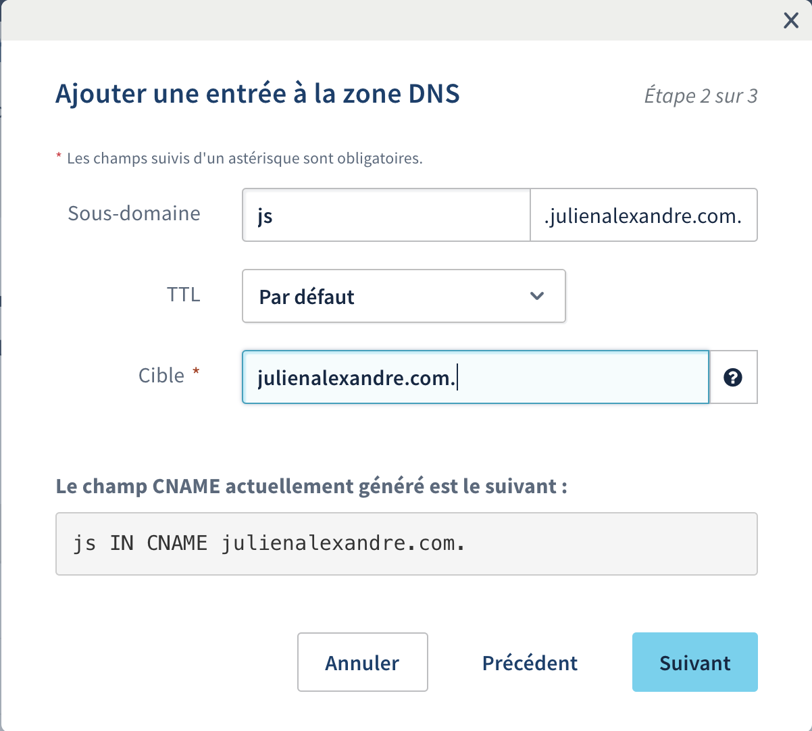
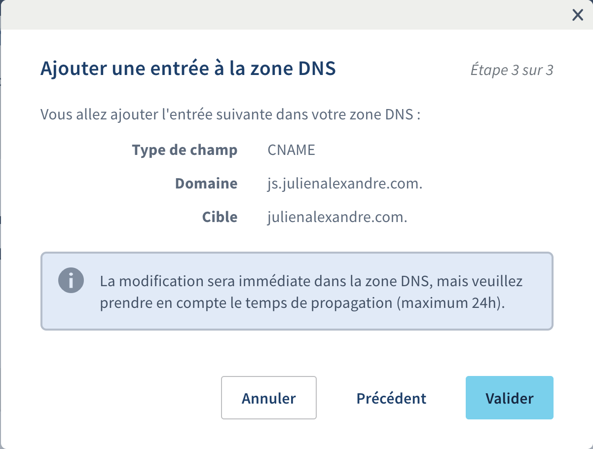

OVH VPS under the operating / distribution system **Debian 10 (Buster) (64 bits)**

## Server installation

### Update

    apt update
    apt upgrade

### Change the root password

    passwd

### Creation of a non-root user 

Source: [How to Create a Non-root User on Your Ubuntu 18.04 VPS or Dedicated Server](https://hostadvice.com/how-to/how-to-create-a-non-root-user-on-ubuntu-18-04-server/)

    adduser <username>

### Generation of SSH keys

Source: [Generating a new SSH key and adding it to the ssh-agent](https://help.github.com/en/github/authenticating-to-github/generating-a-new-ssh-key-and-adding-it-to-the-ssh-agent)

#### On the client

Generate the SSH key (replace `email@gmail.com` by your email):

    ssh-keygen -t rsa -b 4096 -C "email@gmail.com"

Start the ssh-agent in the background:

    $ eval "$(ssh-agent -s)"

Add your SSH private key to the ssh-agent and store your passphrase in the keychain:

    ssh-add -K ~/.ssh/id_rsa

#### On the server

Create the `.ssh/authorized_keys` file and fill with your **public keys**.

Modify the access rights to the folder and the file for the `<user>` account:

        chmod go-rx .ssh
        chmod go-r .ssh/authorized_keys

### Versionning

Installation of `git` and `etckeeper` to version the `/etc` folder:

    apt install git etckeeper

To display `git` in the prompt for `<user>`:

    # Git config
    export GIT_PS1_SHOWDIRTYSTATE=true
    export GIT_PS1_SHOWSTASHSTATE=true
    export GIT_PS1_SHOWUNTRACKEDFILES=true
    export GIT_PS1_SHOWUPSTREAM=auto

    if [ "$color_prompt" = yes ]; then
        PS1='${debian_chroot:+($debian_chroot)}\[\033[01;32m\]\u@\h\[\033[00m\] \w\[\033[01;32m\]$(__git_ps1)\[\033[00m\] \$ '
    else
        PS1='${debian_chroot:+($debian_chroot)}\u@\h \w$(__git_ps1) \$ '
    fi

To display `git` in the prompt for `root`:

    # Git config
    source /etc/bash_completion.d/git-prompt

    export GIT_PS1_SHOWDIRTYSTATE=true
    export GIT_PS1_SHOWSTASHSTATE=true
    export GIT_PS1_SHOWUNTRACKEDFILES=true
    export GIT_PS1_SHOWUPSTREAM=auto

    # PS1 variable
    PS1='${debian_chroot:+($debian_chroot)}\u@\h \w$(__git_ps1) \$ '

### SSH server configuration

Source: [Disable Root SSH Login on Linux](https://www.howtogeek.com/howto/linux/security-tip-disable-root-ssh-login-on-linux/)

Update the `/etc/ssh/sshd_config` file:

    PermitRootLogin no
    PasswordAuthentication no

### Firewall configuration

Source: [Securing your Ubuntu/Debian based VPS using IPTABLES/Netfilter firewall](https://www.rosehosting.com/blog/securing-your-ubuntudebian-based-vps-using-iptablesnetfilter-firewall/)

Source: [An Introduction to Securing your Linux VPS](https://www.digitalocean.com/community/tutorials/an-introduction-to-securing-your-linux-vps)

Add this line at the top of `.bashrc`:

    PATH=/sbin/:$PATH

Create the `/usr/local/bin/fwall-rules` file with this configuration:

```sh
#!/bin/bash

IPTABLES=/sbin/iptables

echo " * flushing old rules"
${IPTABLES} --flush
${IPTABLES} --delete-chain
${IPTABLES} --table nat --flush
${IPTABLES} --table nat --delete-chain

echo " * setting default policies"
${IPTABLES} -P INPUT DROP
${IPTABLES} -P FORWARD DROP
${IPTABLES} -P OUTPUT ACCEPT

echo " * allowing loopback devices"
${IPTABLES} -A INPUT -i lo -j ACCEPT
${IPTABLES} -A OUTPUT -o lo -j ACCEPT

${IPTABLES} -A INPUT -p tcp ! --syn -m state --state NEW -j DROP
${IPTABLES} -A INPUT -m state --state ESTABLISHED,RELATED -j ACCEPT

## BLOCK ABUSING IPs HERE ##
#echo " * BLACKLIST"
#${IPTABLES} -A INPUT -s _ABUSIVE_IP_ -j DROP
#${IPTABLES} -A INPUT -s _ABUSIVE_IP2_ -j DROP

echo " * allowing ssh on port 22"
${IPTABLES} -A INPUT -p tcp --dport 22  -m state --state NEW -j ACCEPT

#echo " * allowing ftp on port 21"
#${IPTABLES} -A INPUT -p tcp --dport 21  -m state --state NEW -j ACCEPT

echo " * allowing dns on port 53 udp"
${IPTABLES} -A INPUT -p udp -m udp --dport 53 -j ACCEPT

echo " * allowing dns on port 53 tcp"
${IPTABLES} -A INPUT -p tcp -m tcp --dport 53 -j ACCEPT

echo " * allowing http on port 80"
${IPTABLES} -A INPUT -p tcp --dport 80  -m state --state NEW -j ACCEPT

echo " * allowing https on port 443"
${IPTABLES} -A INPUT -p tcp --dport 443 -m state --state NEW -j ACCEPT

#echo " * allowing smtp on port 25"
#${IPTABLES} -A INPUT -p tcp -m state --state NEW -m tcp --dport 25 -j ACCEPT

#echo " * allowing submission on port 587"
#${IPTABLES} -A INPUT -p tcp -m state --state NEW -m tcp --dport 587 -j ACCEPT

#echo " * allowing imaps on port 993"
#${IPTABLES} -A INPUT -p tcp -m state --state NEW -m tcp --dport 993 -j ACCEPT

#echo " * allowing pop3s on port 995"
#${IPTABLES} -A INPUT -p tcp -m state --state NEW -m tcp --dport 995 -j ACCEPT

#echo " * allowing imap on port 143"
#${IPTABLES} -A INPUT -p tcp -m state --state NEW -m tcp --dport 143 -j ACCEPT

#echo " * allowing pop3 on port 110"
#${IPTABLES} -A INPUT -p tcp -m state --state NEW -m tcp --dport 110 -j ACCEPT

echo " * allowing ping responses"
${IPTABLES} -A INPUT -p ICMP --icmp-type 8 -j ACCEPT

# DROP everything else and Log it
${IPTABLES} -A INPUT -j LOG
${IPTABLES} -A INPUT -j DROP

#
# Save settings
#
echo " * SAVING RULES"

if [[ -d /etc/network/if-pre-up.d ]]; then
    if [[ ! -f /etc/network/if-pre-up.d/iptables ]]; then
        echo -e "#!/bin/bash" > /etc/network/if-pre-up.d/iptables
        echo -e "test -e /etc/iptables.rules && iptables-restore -c /etc/iptables.rules" >> /etc/network/if-pre-up.d/iptables
        chmod +x /etc/network/if-pre-up.d/iptables
    fi
fi

iptables-save > /etc/fwall.rules
iptables-restore -c /etc/fwall.rules
```

Make the file executable:

    chmod +x /usr/local/bin/fwall-rules

Apply configuration:

    fwall-rules

### Installation of basic packages

    apt install curl build-essential nginx

You can see that the server is running.

### MySQL installation

Download MySQL and extract the archive:

    wget https://dev.mysql.com/get/mysql-apt-config_0.8.15-1_all.deb
    dpkg -i mysql-apt-config_0.8.15-1_all.deb

Disable the folling functionnalities:

- MySQL Tools & Connectors

- MySQL Preview Packages

Updating the package list:

    apt update

Installtion of MySQL:

    apt install mysql-server

### PHP 7.4 installation (optional)

Source: [How To Install PHP on Debian 10 (Buster)](https://tecadmin.net/install-php-on-debian-10-buster/)

    sudo apt install ca-certificates apt-transport-https
    wget -q https://packages.sury.org/php/apt.gpg -O- | sudo apt-key add -
    echo "deb https://packages.sury.org/php/ buster main" | tee /etc/apt/sources.list.d/php.list
    apt update
    apt install php7.4-fpm php7.4-mysql

Update the Nginx configuration :

    nano /etc/nginx/sites-available/default

Uncomment this code:

    location ~ \.php$ {
      include snippets/fastcgi-php.conf;

      # With php-fpm (or other unix sockets):
      fastcgi_pass unix:/var/run/php/php7.4-fpm.sock;
      # With php-cgi (or other tcp sockets):
      # fastcgi_pass 127.0.0.1:9000;
    }

Add `index.php` on this line:

    # Add index.php to the list if you are using PHP
    index index.html index.php index.htm index.nginx-debian.html;

Reload the Nginx server:

    /etc/init.d/nginx restart

## Generation of SSL certificates

### Add Backports repo

Source: [Debian Backports](https://backports.debian.org/Instructions/)

Update the `/etc/apt/sources.list` file:

    deb http://deb.debian.org/debian buster-backports main

Update the packages:

    apt update
    apt install buster-backports

### Installation of Certbot

Source: [Certbot Nginx on Debian 10 (buster)](https://certbot.eff.org/lets-encrypt/debianbuster-nginx)

    apt install certbot python-certbot-nginx

Launch the **Certbot** configuration (replace `<domain>` and `<subdomain>` by your informations):

    certbot certonly -d <domain> -d <subdomain> -w /var/www/html

ou

    certbot certonly --nginx

Select the third option:

    How would you like to authenticate with the ACME CA?
    - - - - - - - - - - - - - - - - - - - - - - - - - - - - - - - - - - - - - - - -
    1: Nginx Web Server plugin - Alpha (nginx)
    2: Spin up a temporary webserver (standalone)
    3: Place files in webroot directory (webroot)
    - - - - - - - - - - - - - - - - - - - - - - - - - - - - - - - - - - - - - - - -
    Select the appropriate number [1-3] then [enter] (press 'c' to cancel): 3

Enter your email address to be notified when the certificate expires (usually 90 days) (replace `email@gmail.com` by your email):

    Enter email address (used for urgent renewal and security notices) (Enter 'c' to cancel): email@gmail.com

### Update the Nginx configuration

    nano /etc/nginx/sites-available/default

Remove these lines:

    listen 80 default_server;
    listen [::]:80 default_server;

Uncomment these lines and add the certificate path (replace `<domain>` by the real domain name):

    listen 443 ssl default_server;
    listen [::]:443 ssl default_server;

    ssl_certificate /etc/letsencrypt/live/<domain>/fullchain.pem;
    ssl_certificate_key /etc/letsencrypt/live/<domain>/privkey.pem;

Add these lines to redirect `http` requests to `https`:

    server {
      listen 80 default_server;
      listen [::]:80 default_server;
      server_name _;
      return 301 https://$host$request_uri;
    }

Reload the Nginx server:

    /etc/init.d/nginx restart

## Creation of subdomains

### Create the subdomain on OVH

Go to the **DNS zone** section of the [OVH administration interface](https://www.ovh.com/manager/web/index.html?#/configuration/) and select `CNAME`




/!\ Note the `.` at the end of the `Cible` line.





You can see your new subdomain in the list.


### Nginx configuration by subdomain

Create a specific configuration file for the subdomain:

    cp /etc/nginx/sites-available/default /etc/nginx/sites-available/<subdomain>.<domain>

Edit the file and fill like this (replace `<subdomain>` and `<domain>` by the real domain name):

    server {
      # SSL configuration
      listen 443 ssl;
      listen [::]:443 ssl;
      
      ssl_certificate /etc/letsencrypt/live/<domain>/fullchain.pem;
      ssl_certificate_key /etc/letsencrypt/live/<domain>/privkey.pem;

      # Add index.php to the list if you are using PHP
      index index.html index.htm index.nginx-debian.html;

      server_name <subdomain>;

      # Proxy buffer
      proxy_buffers 16 64k;
      proxy_buffer_size 128k;
      
      location / {
          # Change the port if you want
          proxy_pass http://localhost:8000;
          proxy_http_version 1.1;
          proxy_set_header Upgrade $http_upgrade;
          proxy_set_header Connection 'upgrade';
          proxy_set_header Host $host;
          proxy_set_header X-Real_IP $remote_addr;
          proxy_set_header X-Forwarded_For $proxy_add_x_forwarded_for;
          proxy_cache_bypass $http_upgrade;
          proxy_max_temp_file_size 0;
      }
    }

Update the default Virtual Host configuration in `/etc/nginx/sites-available/default` file:

    server {
      listen 80 default_server;
      listen [::]:80 default_server;
      server_name _;
      return 301 https://$host$request_uri;
    }

Create a symbolic link in `/etc/nginx/sites-enabled/` folder:

    cd /etc/nginx/sites-enabled
    ln -s ../sites-available/js.julienalexandre.com

Reload the Nginx server:

    /etc/init.d/nginx restart

## Deploy a React / NodeJS project

### Installation of NodeJS

Source: [NodeJS installation](https://github.com/nodesource/distributions#debinstall)

    curl -sL https://deb.nodesource.com/setup_12.x | sudo -E bash -
    apt install -y nodejs

Installation of **Yarn**:

    curl -sL https://dl.yarnpkg.com/debian/pubkey.gpg | sudo apt-key add -
    echo "deb https://dl.yarnpkg.com/debian/ stable main" | sudo tee /etc/apt/sources.list.d/yarn.list
    apt update
    apt install yarn

Installation of **PM2**:

    npm install -g pm2

Initialize **PM2**:

    pm2 init
